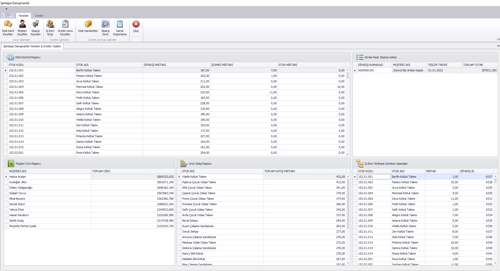
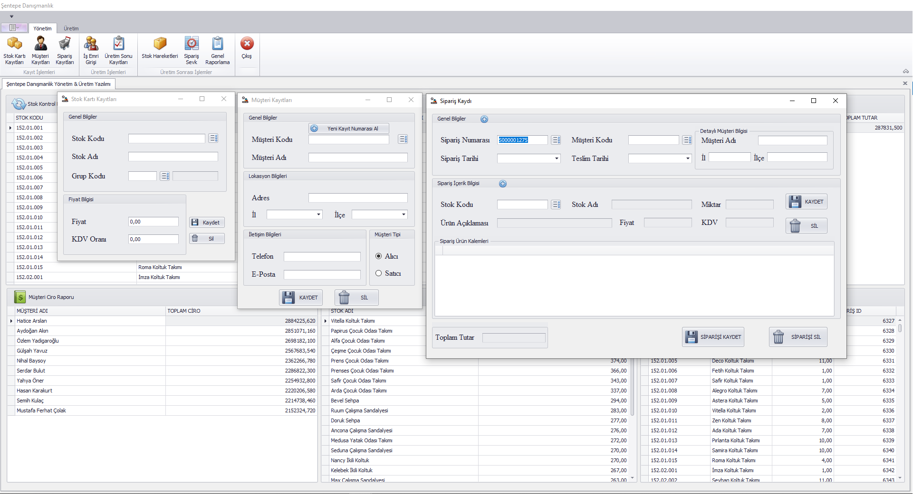
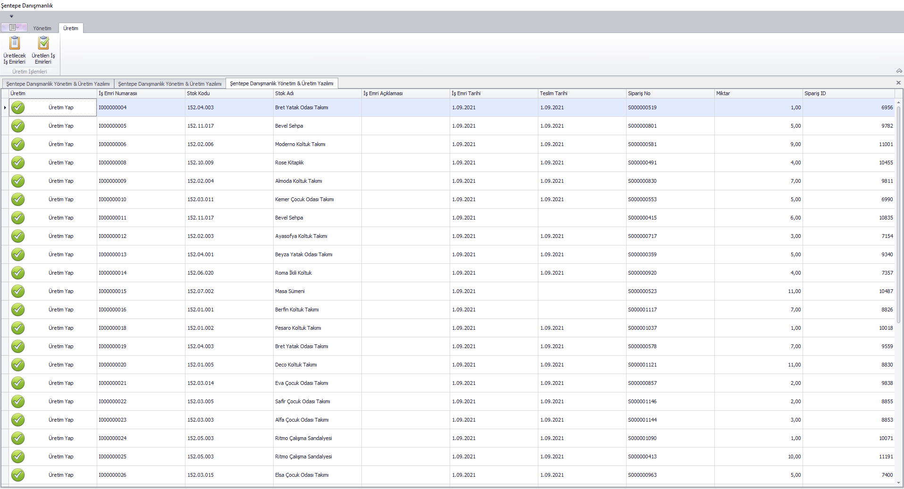

# ERP System (Management and Production Automation)

This project is an ERP (Enterprise Resource Planning) system developed to assist businesses in effectively managing their management and production processes. Our project includes various modules to support essential functions such as inventory management, customer relations, order tracking, production operations, and reporting.

(This project was made by following Yasin Taşdemir's Management and Production Software course with C# & SQL Server on Udemy.)

## Features

The project includes the following modules:

**1- Stock Card Records Module:** Used to track and manage the inventory of the business. Data such as stock codes, stock names, and prices are stored in this module.

**2- Customer Records Module:** Used to record and manage customer information. Data that facilitates customer tracking, such as contact information and buyer/seller status, is stored here.

**3- Order Records Module:** Used to receive, track, and manage customer orders. Important data such as order dates, product information, and payment details are managed within this module.

**4- Work Order Entry Module:** Used to plan and track production operations. Information such as work orders and stock and job processing dates entered into the system based on orders is found in this module.

**5- Production End Records Module:** Contains information recorded after the completion of product production stages. Existing production end records, open work orders, and detailed information for a given job order number can be observed here, along with operations such as record deletion.

**6- Stock Movements Module:** Used to track and report changes in stock inventory. Operations such as incoming and outgoing stock quantities, transfers, and inventory adjustments are recorded in this module.

**7- Shipment Module:** Used to prepare and manage the shipment of completed orders. This module allows for the observation of ready-to-ship orders, their individual content details, and the completion of the shipping process by creating a stock movement record.

**8- Production Screen Design:** Provides a user-friendly interface to visually track production processes. Production orders and completed production orders are processed here.

**9- Main Report Screen:** A general report screen is created with reports that can answer questions that may arise in the fields of management and production, providing access to all modules.

## Installation and Usage

After downloading the project, you should enter your own database connection address in the **'DATABASE CONNECTION ADRESS'** section for each module within the project. This will allow the project to run successfully.

An example database used in the project is located in the folder as the **'Uretim ve Yonetim Sistemi.bak'** file.

## Support 

You can reach out to me via [LinkedIn](https://www.linkedin.com/in/tugberk-sentepe/) or any issues you encounter. 

## Some Screenshots from the Project

